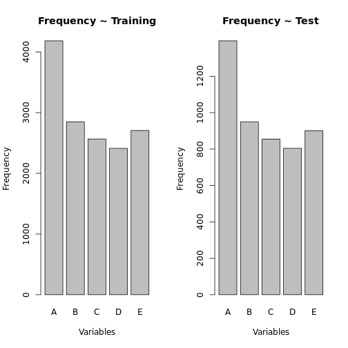
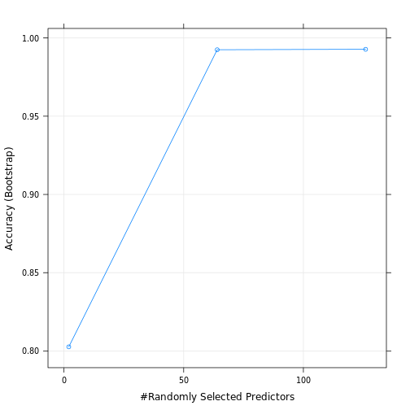

Practical Machine Learning - Writeup Submission
========================================================

# Motivation  

This project concerns the to use data from accelerometers on the belt, forearm, arm, and dumbell of 6 participants. They were asked to perform barbell lifts correctly and incorrectly in 5 different ways. More information is available from the website here: http://groupware.les.inf.puc-rio.br/har (see the section on the Weight Lifting Exercise Dataset).  The project has essentially four steps: (1) loading and cleaning data, (2) Exploring the Data,  (3) Building and Validating a Model, and (4) predicting outcomes and measuring results. 

# Step 1- Loading and Cleaning Data 

In this case, the principal provided two dataset, Training and Testing.  The training data set names "pml-training.csv" had 19622 observations and 160 variables, while the testing data set had 20 observations with 160 variables.  Importantly, the training data set had a row ID which the testing dataset did not and the testing data set did not have the "classe" variable which was the target variables.  It is worth noting that the original data set, from the provider website had 39,242 observations with 159 variables.  

One of the problems with the training data set was the number of variables, hence I used the near-zero function to remove insignificant variables from the training data set.  This action cut down on the time in which it took took to build the model and in some instances the model did not converge without the removal of these insignificant variables.  

Finally, I separated the training set into "training" and "testing" where to the testing set, which is a subset of the training set is merely a validation data set. 


```r
  pml.training <- read.csv("pml-training.csv", stringsAsFactors=FALSE)
  pml.training$classe <- as.factor(pml.training$classe)
  #
  library(caret) 
```

```
## Loading required package: lattice
## Loading required package: ggplot2
```

```r
  inTrain <- createDataPartition(y=pml.training$classe, p=0.75, list=FALSE)
  training <- pml.training[inTrain,]
  testing <- pml.training[-inTrain,]
  
  # Pull out the Near Zero Value (NZV)
  nzv <- nearZeroVar(training, saveMetrics=TRUE)
  omit <- which(nzv$nzv==TRUE)
  training <- training[,-omit]
  testing <- testing[,-omit]
```

# Step 2 - Exploring the Data 

Perhaps the most important aspect of the data sets is to compare the distribution of the target variables in the training and validation sets. This is done with a simple plot command. 


```r
par(mfrow=c(1,2))
plot(training$class, xlab="Variables", ylab="Frequency", main="Frequency ~ Training")
plot(testing$classe,xlab="Variables", ylab="Frequency", main="Frequency ~ Test")
```

 

# Step 3 - Build the Model 

For this step of the project I used the Random Forest model. For a discussion of this approach see: Breiman, L (2002), “Manual On Setting Up, Using, And Understanding Random Forests V3.1”; http://oz.berkeley.edu/users/breiman/Using_random_forests_V3.1.pdf.  A review of the MSE plot shows a pretty good fit, i.e. 0.8% error on cross-validation.  The model converged with approximately 60 variables and in 127 rounds.  


```r
modFit <- train(classe ~., method="rf", data=training)
```

```
## Loading required package: randomForest
## randomForest 4.6-7
## Type rfNews() to see new features/changes/bug fixes.
```

```r
par(mfrow=c(1,2))
plot(modFit)
```

 

```r
print(modFit$finalModel)
```

```
## 
## Call:
##  randomForest(x = x, y = y, mtry = param$mtry) 
##                Type of random forest: classification
##                      Number of trees: 500
## No. of variables tried at each split: 126
## 
##         OOB estimate of  error rate: 0.67%
## Confusion matrix:
##    A  B  C  D  E class.error
## A 70  0  0  0  0     0.00000
## B  0 63  1  0  0     0.01562
## C  0  1 50  0  0     0.01961
## D  0  0  0 55  0     0.00000
## E  0  0  0  0 59     0.00000
```

```r
print(modFit)
```

```
## Random Forest 
## 
## 14718 samples
##   104 predictors
##     5 classes: 'A', 'B', 'C', 'D', 'E' 
## 
## No pre-processing
## Resampling: Bootstrapped (25 reps) 
## 
## Summary of sample sizes: 299, 299, 299, 299, 299, 299, ... 
## 
## Resampling results across tuning parameters:
## 
##   mtry  Accuracy  Kappa  Accuracy SD  Kappa SD
##   2     0.8       0.8    0.04         0.05    
##   60    1         1      0.008        0.01    
##   100   1         1      0.007        0.009   
## 
## Accuracy was used to select the optimal model using  the largest value.
## The final value used for the model was mtry = 126.
```


# Step 4 - Build a Prediction Model 

The last step is to build a prediction model. I would expected the error rate for the prediction to be low given the OOB error rate from the traning model; unfortunately, I was unable to achive the same results at this point in time (I will be continuing my work on the model) on the validation set.  Below is the code used in this portion of the analysis. 


```r
  pred <- predict(modFit, newdata=testing)
```

# Conclusion. 

While I am able to produce a trained model using the Random Forest model with a very low OOB error rate, there still is considerable work to do to translate this into a predictive model to use on independant test sets.  I would note that I did not apply the predictive model to the supplied test set of 20 observations as there is no known classe to measure error, therefore the results may, and probably will be different. 


